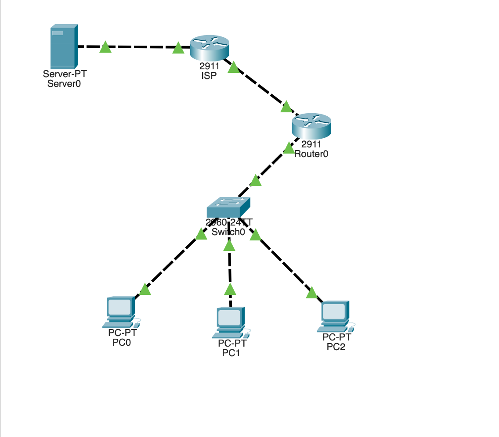

# Empresa com Acesso à Internet

## Contexto do projecto

Este projecto consiste na implementação de uma infraestrutura de rede empresarial com **acesso a uma rede externa**, simulando o cenário de uma empresa que necessita de permitir que os seus utilizadores internos acedam à Internet.

A infraestrutura foi desenvolvida e testada no **Cisco Packet Tracer**, utilizando routing para estabelecer a comunicação entre as redes, **NAT/PAT** para traduzir os endereços privados dos dispositivos internos e **ACLs** para controlar o tráfego permitido.

O principal objectivo foi compreender como diferentes tecnologias de networking podem trabalhar em conjunto para fornecer conectividade externa aos utilizadores de uma rede empresarial.

Do ponto de vista de administração de redes, o projecto foi desenvolvido para:

- Configurar o routing entre a rede interna e a rede externa.
- Implementar **NAT** para traduzir endereços IP privados.
- Implementar **PAT (NAT Overload)** para permitir que vários dispositivos internos partilhem um endereço IP público.
- Utilizar **ACLs** para definir quais endereços internos podem ser traduzidos.
- Configurar o acesso dos utilizadores à rede externa.
- Verificar as traduções NAT realizadas pelo router.
- Testar a conectividade entre a rede interna e a rede externa.
- Realizar troubleshooting de routing, NAT e ACL.

## Tecnologias utilizadas

- Cisco Packet Tracer
- NAT
- PAT / NAT Overload
- ACL
- IPv4
- Routing
- Cisco IOS
- ICMP / Ping
- Routers Cisco
- Switching

# Resumo executivo

### Visão geral do projecto

O laboratório teve como objectivo permitir que dispositivos pertencentes a uma rede interna empresarial conseguissem comunicar com uma rede externa.

Como os computadores da rede interna utilizam **endereços IPv4 privados**, esses endereços não podem ser utilizados directamente para comunicação através da Internet. Para resolver este problema, foi implementado **NAT/PAT** no router de fronteira.

O PAT permitiu que vários dispositivos internos utilizassem um único endereço IP público através da utilização de diferentes números de porta.

Foi também utilizada uma **ACL** para definir quais endereços da rede interna poderiam participar no processo de tradução.

### Principais conhecimentos adquiridos

1. **NAT:**

   Aprendi como o NAT permite traduzir endereços IP privados utilizados na rede interna para endereços que podem ser utilizados numa rede externa.

2. **PAT / NAT Overload:**

   Aprendi como o PAT permite que vários dispositivos internos partilhem um único endereço IP público, diferenciando as diferentes sessões através dos números de porta.

3. **ACL:**

   Aprendi a utilizar uma Access Control List para identificar quais endereços da rede interna devem ser autorizados a participar no processo de NAT.

4. **Routing:**

   Consolidei conhecimentos de routing e compreendi que o NAT, por si só, não fornece conectividade. É necessário que existam rotas correctas entre a rede interna, o router de fronteira e a rede externa.

5. **Inside e Outside:**

   Aprendi a distinguir as interfaces do router voltadas para a rede interna (`inside`) das interfaces voltadas para a rede externa (`outside`).

6. **NAT Translation Table:**

   Aprendi a verificar as traduções criadas pelo router e a analisar como os endereços privados dos dispositivos internos são convertidos durante a comunicação externa.

7. **Troubleshooting:**

   Aprendi a diagnosticar problemas de acesso externo verificando o endereço IP, gateway, routing, ACLs e traduções NAT.

# Análise aprofundada

### Categoria 1: Estrutura da rede

A infraestrutura foi dividida entre uma **rede interna empresarial** e uma **rede externa**, representando uma ligação semelhante à existente entre uma empresa e um ISP.

Os computadores da rede interna utilizam endereços IPv4 privados e comunicam através de um router responsável por encaminhar o tráfego para a rede externa.

  

Esta estrutura permitiu compreender o papel do router de fronteira como ponto de ligação entre a rede privada e a rede externa.

### Categoria 2: Routing

Antes de implementar o NAT, foi necessário garantir que existia conectividade entre as diferentes redes.

O routing foi configurado para permitir que os pacotes provenientes da rede interna fossem encaminhados para a rede externa e que as respostas pudessem regressar correctamente.

Esta etapa reforçou o conhecimento sobre:

- Redes directamente conectadas;
- Rotas estáticas;
- Default Route;
- Next-Hop;
- Routing Table.

A configuração correcta do routing foi fundamental para o funcionamento do acesso externo.

### Categoria 3: Implementação do NAT

Foi implementado **Network Address Translation (NAT)** para realizar a tradução dos endereços privados utilizados pelos computadores internos.

Através do NAT, o router consegue substituir o endereço de origem privado por um endereço utilizado na interface externa.

Este processo permitiu compreender porque o NAT é frequentemente utilizado em redes empresariais que possuem muitos dispositivos internos e um número limitado de endereços públicos.

### Categoria 4: PAT / NAT Overload

Para permitir que vários computadores internos utilizassem simultaneamente o acesso externo, foi implementado **PAT (Port Address Translation)**.

O PAT permite que vários endereços privados sejam traduzidos para um único endereço público, utilizando diferentes números de porta para distinguir as sessões.

Desta forma:

**Vários IPs privados → Um IP público + diferentes portas**

Esta configuração permitiu compreender a diferença entre NAT tradicional e PAT e a razão pela qual o PAT é amplamente utilizado no acesso à Internet.

### Categoria 5: ACL aplicada ao NAT

Foi criada uma **ACL** para identificar os endereços IP da rede interna autorizados a serem traduzidos.

A ACL permitiu controlar quais dispositivos poderiam utilizar o mecanismo de NAT/PAT.

Esta etapa demonstrou que uma ACL pode ser utilizada não apenas para bloquear ou permitir tráfego directamente, mas também para definir quais endereços devem ser considerados pelo processo de tradução NAT.

### Categoria 6: Verificação das traduções

Depois da configuração do NAT/PAT, foram analisadas as traduções criadas pelo router.

A tabela de traduções permitiu observar a relação entre:

- Endereço IP privado;
- Endereço IP traduzido;
- Porta utilizada;
- Destino externo;
- Estado da sessão.

Esta verificação foi importante para compreender o funcionamento interno do NAT/PAT e confirmar que as traduções estavam a ser realizadas correctamente.

### Categoria 7: Testes de conectividade

Foram realizados testes utilizando `ping` para verificar a comunicação entre os dispositivos internos e a rede externa.

Os testes permitiram validar:

- Configuração dos endereços IPv4;
- Default Gateway;
- Routing;
- ACL;
- NAT/PAT;
- Comunicação com a rede externa.

Durante o troubleshooting, a análise foi realizada por etapas, verificando primeiro a conectividade local, depois o routing e finalmente o processo de tradução NAT.

# Resultado final

A implementação resultou numa infraestrutura capaz de **permitir que utilizadores da rede interna acedessem a uma rede externa através de NAT/PAT**.

O PAT permitiu que múltiplos dispositivos internos partilhassem um endereço IP público, enquanto a ACL foi utilizada para definir os dispositivos internos autorizados a participar no processo de tradução.

O projecto permitiu consolidar conhecimentos de **routing, NAT, PAT, ACLs, IPv4, tabelas de tradução e troubleshooting**, aproximando o laboratório de um cenário comum de uma rede empresarial com acesso à Internet.

## Competências desenvolvidas

- Configuração de NAT
- Configuração de PAT / NAT Overload
- Configuração de ACLs
- Routing IPv4
- Default Route
- Configuração de interfaces Inside/Outside
- Análise da NAT Translation Table
- Controlo de endereços através de ACL
- Testes de conectividade
- Troubleshooting de NAT e routing
- Utilização de Cisco IOS
- Utilização do Cisco Packet Tracer
